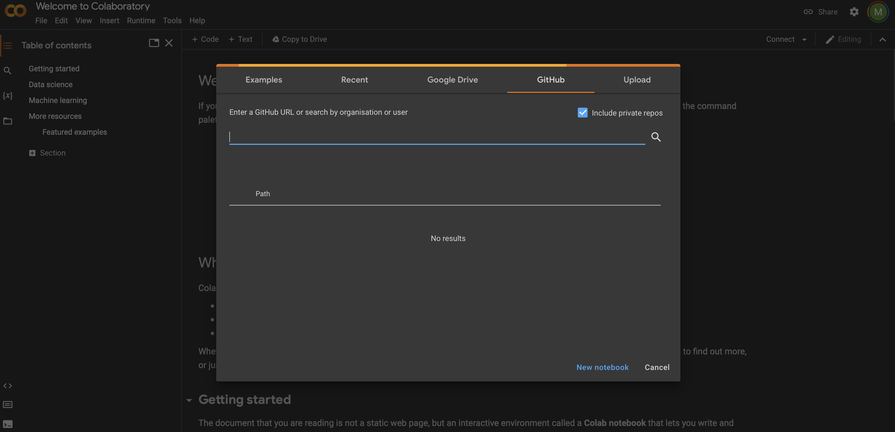

# Climate_Practical
Practical London NERC DTP / Principles of Climate

What you will need to do to run this practical is simply to open the notebook in Google Collab (see screenshot below). 

- For the Arctic practical: use this link https://github.com/mimi1981/Climate_Practical/blob/main/Climate_Practical_Arctic.ipynb
- For the Mediteranean practical: use this link https://github.com/mimi1981/Climate_Practical/blob/main/Climate_Practical_Mediterranean.ipynb

 

